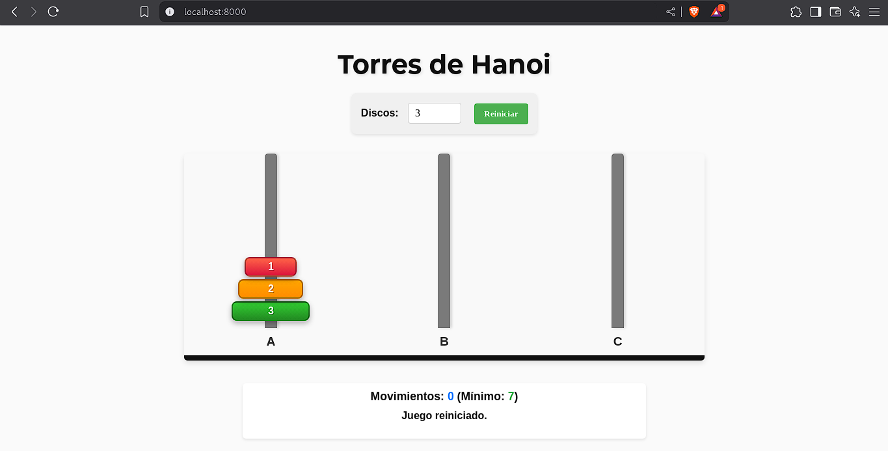

# Towers of Hanoi - Prolog Implementation with Web Interface

This project implements the classic Towers of Hanoi puzzle using Prolog as the backend and an interactive web interface with HTML, CSS, and JavaScript.

## Description

The Towers of Hanoi is a mathematical puzzle that consists of moving disks of different sizes between three pegs (or towers), following these rules:

1. Only one disk can be moved at a time.
2. Each move consists of taking the top disk from one tower and placing it on another tower.
3. No disk may be placed on top of a smaller disk.

The goal is to move all disks from tower A to tower C in the minimum number of moves possible.

## Requirements

-   SWI-Prolog (version 8.0 or higher)

## Installation & Execution

1. Clone or download this repository.

### Web Server Mode

1. Navigate to the project directory.
2. Run SWI-Prolog with the `hanoi_server.pl` file:

    ```
    swipl hanoi_server.pl
    ```

3. By default, the server will start at http://localhost:8000
4. Open your browser and visit that address to start playing.

To change the default port, edit the `default_port(8000)` line in `hanoi_server.pl`.

## Project Structure

-   `hanoi.html` - Main web page of the game.
-   `hanoi_style.css` - CSS styles for the web interface.
-   `hanoi_script.js` - JavaScript logic for user interaction.
-   `hanoi_server.pl` - Prolog server that handles the web API and game logic.
-   `hanoi.pl` - Base implementation of the Towers of Hanoi for console use.


